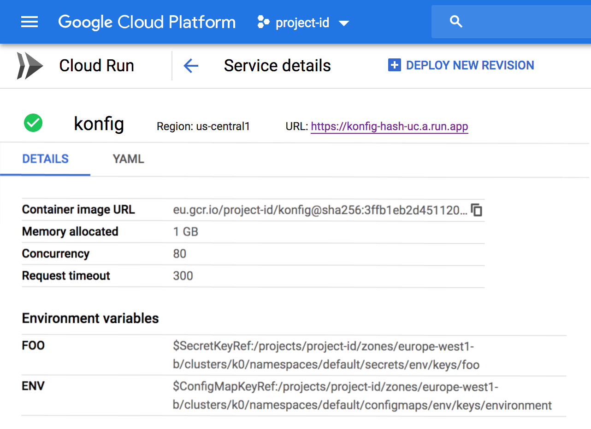

Poor man's python implementation of [Kelsey Hightower's Go Konfig][kelseyhightower-konfig]

> * no support for Cloud Functions
> * no support for config files in secrets
> * not packaged

#### Commandless testing: 
[![Run on Google Cloud][cloud-run-button]][cloud-shell-link-with-git-repo]
> Then deploy a new revision of this service with your secret environment variables :)
---

# Konfig 

konfig enables serverless workloads running on GCP to reference Kubernetes configmaps and secrets stored in GKE clusters at runtime. konfig currently supports Cloud Run workloads.

## How Does it Work

The side effect of importing the `konfig` library will cause konfig to:

* call the Cloud Run to get a list of env vars to process. We avoid scanning the running environment as any library can set env vars before konfig runs.
* retrieve the GKE endpoint based on the secret or configmap reference
* retrieve configmap and secret keys from the GKE cluster using the service account provided to the Cloud Run or Cloud Function instance.
* substitute the reference string with the value of the configmap or secret key.

References to Kubernetes configmaps and secrets can be made when defining Cloud Run environment variables using the [reference syntax][kelseyhightower-konfig-reference-syntax].

## Tutorial

A GKE cluster is used to store configmaps and secrets referenced by Cloud Run and Cloud Function workloads. Ideally an existing cluster can be used. For the purpose of this tutorial create the smallest GKE cluster possible in the `europe-west1b` zone-:

```
gcloud container clusters create k0 \
  --cluster-version latest \
  --no-enable-basic-auth \
  --no-enable-ip-alias \
  --metadata disable-legacy-endpoints=true \
  --no-issue-client-certificate \
  --num-nodes 1 \
  --machine-type g1-small \
  --scopes gke-default \
  --zone europe-west1-b
```

Download the credentials for the `k0` cluster:

```
gcloud container clusters get-credentials k0 \
  --zone europe-west1-b
```

We only need the Kubernetes API server as we only plan to use Kubernetes as an secrets and config store, so delete the default node pool.

```
gcloud container node-pools delete default-pool \
  --cluster k0 \
  --zone europe-west1-b
```

With the `k0` GKE cluster in place it's time to create the secrets that will be referenced later in the tutorial.  

Create the `env` secret with two keys `foo` and `config.json` which holds the contents of the configuration file created in the previous step:

```
kubectl create secret generic env \
  --from-literal foo=bar
```

Create the `env` configmap with a single key `environment`:

```
kubectl create configmap env \
  --from-literal environment=production
```

At this point the `env` secret and configmap can be referenced from Cloud Run using `konfig`.


> Example config env variables refering to kubernetes secrets

### Cloud Run Tutorial

In this section Cloud Run will be used to deploy the container image which responds to HTTP requests with the contents of the `ENVIRONMENT` and `FOO` environment variables, which references the `env` secret and configmap created in the previous section.

A GKE cluster ID is required when referencing configmaps and secrets. Extract the cluster ID for the `k0` GKE cluster:

```
CLUSTER_ID=$(gcloud container clusters describe k0 \
  --zone europe-west1-b \
  --format='value(selfLink)')
```

Strip the `https://container.googleapis.com/v1` from the previous response and store the results:

```
CLUSTER_ID=${CLUSTER_ID#"https://container.googleapis.com/v1"}
```

> The CLUSTER_ID env var should hold the fully qualified path to the k0 cluster. Assuming `project-id` as the project ID the value would be `/projects/project-id/zones/europe-west1-b/clusters/k0`.

Create the Cloud Run service and set the `ENVIRONMENT` and `FOO` env vars to reference the `env` configmaps and secrets in the `k0` GKE cluster:

```
gcloud alpha run deploy konfig \
  --allow-unauthenticated \
  --concurrency 50 \
  --image gcr.io/project-id/konfig \
  --memory 2G \
  --region us-central1 \
  --set-env-vars "FOO=\$SecretKeyRef:${CLUSTER_ID}/namespaces/default/secrets/env/keys/foo,ENVIRONMENT=\$ConfigMapKeyRef:${CLUSTER_ID}/namespaces/default/configmaps/env/keys/environment"
```

Retrieve the `konfig` service HTTP endpoint:

```
KONFIG_SERVICE_URL=$(gcloud alpha run services describe env \
  --namespace project-id \
  --region us-central1 \
  --format='value(status.domain)')
```

Make an HTTP request to the `konfig` service:

```
curl $KONFIG_SERVICE_URL
```

Output:
```
ENVIRONMENT: production
FOO: bar
```

[//]: # (Links)
[cloud-run-button]: https://storage.googleapis.com/cloudrun/button.png
[cloud-shell-link-with-git-repo]: https://console.cloud.google.com/cloudshell/editor?shellonly=true&cloudshell_image=gcr.io/cloudrun/button&cloudshell_git_repo=https://github.com/Limezest/konfig
[kelseyhightower-konfig]: https://github.com/kelseyhightower/konfig
[kelseyhightower-konfig-reference-syntax]: https://github.com/kelseyhightower/konfig/blob/master/docs/reference-syntax.md